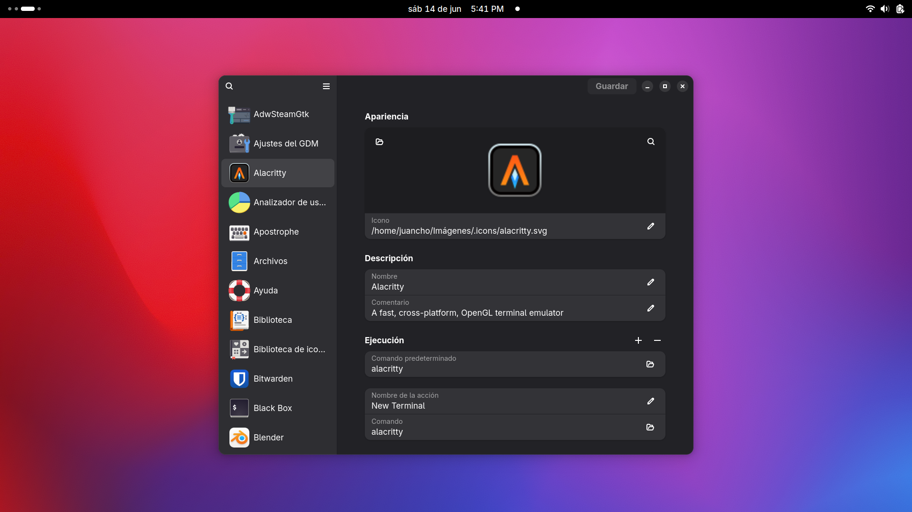

# Una serie de iconos para mejorar la experiencia de GNOME

## Aplicaciones

- Zen Browser
- Zed IDE
- Inkscape
- Alacritty
- Local Send
- Notion (Cohesion)
- Blender

## Como aplicar los iconos

1. Descargar Menu Libre desde [flathub](https://flathub.org/apps/details/com.github.libre.menu)
2. Clonar el respositorio
3. Abrir Menu Libre
4. Buscar la aplicación a cambiar
5. Seleccionar el icono deseado
